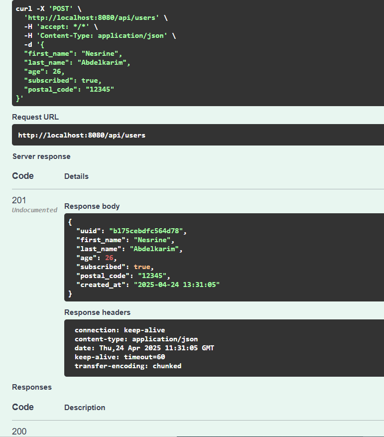
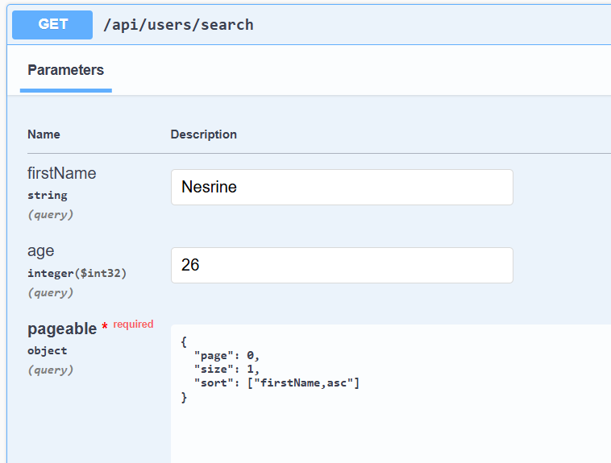
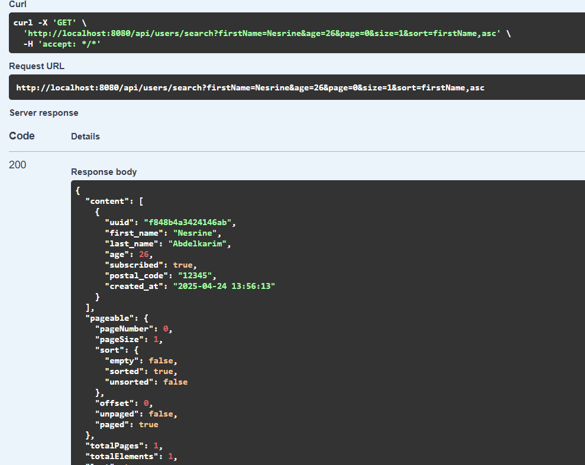
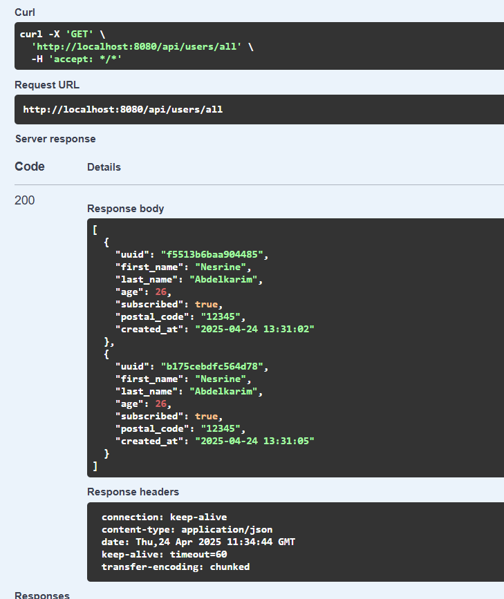
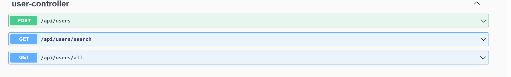

# 💼 User Management 

A RESTful web service built with Spring Boot and Java 17, designed for managing users in an in-memory H2 database. This application showcases best practices for creating, retrieving, filtering (by age and first name), and paginating user data. It also includes interactive Swagger/OpenAPI documentation for easy testing and exploration of the API endpoints.

---

## 📌 Features

- Create a new user using DTOs and validation
- List all users with pagination
- Filter users by first name and/or age
- Swagger UI integration for API documentation and testing
- Clean layered architecture (Controller → Service → Repository)

---

##  Tech Stack

| Component           | Version |
|---------------------|------|
| Java                | 17   |
| Spring Boot         | 3.1.5 |
| Spring Web          | ✅    |
| Spring Data JPA     | ✅    |
| H2 Database         | ✅    |
| Maven   | ✅  |
| JUnit 5 |	✅ |
| Mockito	 | ✅ |

---

## 📁 Project Architecture

```
src/
├── main/
│   ├── java/
│   │   └── es.ibm.usermanagement/
│   │       ├── controller/       → UserController, UserAuditController
│   │       ├── service/          → UserService, UserAuditService
│   │       ├── repository/       → UserRepository, UserAuditRepository
│   │       ├── entity/           → User, UserAudit
│   │       ├── config/           → CacheConfig
│   │       └── dto/              → UserRequest
│   └── resources/
│       └── application.yml
├── test/
│   └── java/
│       └── es.ibm.usermanagement/
│           ├── controller/       → UserControllerTest
├── Dockerfile                    → Docker support

```

---

## 🚀 Getting Started

### 1. Clone the project

```bash
git clone https://github.com/nesrineabkk/user-management.git
cd user-management

```

### 2. Run the Spring Boot Application

You can run it using:

```bash
./mvnw spring-boot:run
```

Or from your IDE (IntelliJ, Eclipse).

---

##  Example JSON for Creating a User json

```

POST /api/users
Content-Type: application/json

{
  "first_name": "Nesrine",
  "last_name": "Abdelkarim",
  "age": 26,
  "subscribed": true,
  "postal_code": "29014"
}
```



---

##  View Users & Filter & Paginate

### List all users
```http
GET /api/users/search
```

###  Filter by first name
```http
GET /api/users/search?firstName=Nesrine
```

###  Filter by age
```http
GET /api/users/search?age=26
```

###  Filter by both + paginate
```http
GET /api/users/search?firstName=Nesrine&age=26&page=0&size=5&sort=firstName,asc
```




###  View all Users




---

## Swagger / OpenAPI Docs

Thanks to **Springdoc OpenAPI**, you can explore and test the API interactively.

### Added Swagger Library

```xml
<dependency>
  <groupId>org.springdoc</groupId>
  <artifactId>springdoc-openapi-starter-webmvc-ui</artifactId>
  <version>2.2.0</version>
</dependency>
```

###  Access Swagger UI

After starting the app, open:

```
http://localhost:8080/swagger-ui.html
```
or
```
http://localhost:8080/swagger-ui/index.html
```



---
##  H2 Database Console
Access the in-memory database via:
```
http://localhost:8080/h2-console
```
**JDBC URL:**
```
jdbc:h2:mem:testdb
```
**Username:** `sa`  
**Password:** *(leave empty)*

⚠️ Note: If you encounter an issue with the H2 database (e.g., startup errors), try deleting the following files from the database folder:
`testdb.mv.db`
`testdb.trace.db`

Then restart the application.
###  JUnit 5 and Mockito Testing
#### Added Libraries for Testing
```
<!-- Spring Boot Test (includes Mockito, MockMvc, etc.) -->
<dependency>
  <groupId>org.springframework.boot</groupId>
  <artifactId>spring-boot-starter-test</artifactId>
  <scope>test</scope>
  <exclusions>
    <exclusion>
      <groupId>org.junit.vintage</groupId>
      <artifactId>junit-vintage-engine</artifactId>
    </exclusion>
  </exclusions>
</dependency>
```
## Run Tests
```
./mvnw test
```
---
# Caching  
Dependency of  Caching in  pom.xml
```
<dependency>
    <groupId>org.springframework.boot</groupId>
    <artifactId>spring-boot-starter-cache</artifactId>
</dependency>

```
#  Docker
Spring Boot Maven Plugin (in pom.xml):
```
<build>
    <plugins>
        <plugin>
            <groupId>org.springframework.boot</groupId>
            <artifactId>spring-boot-maven-plugin</artifactId>
        </plugin>
    </plugins>
</build>
```
### Dockerfile
```
FROM eclipse-temurin:17-jdk-alpine

WORKDIR /app

COPY target/user-management-application-0.0.1-SNAPSHOT.jar app.jar

EXPOSE 8080

ENTRYPOINT ["java", "-jar", "app.jar"]

```
#### How to Build & Run with Docker
##### Build the project:
```
./mvnw clean install
```
##### Check target directory:
```
target/user-management-application-0.0.1-SNAPSHOT.jar
```
##### Build Docker image:
```
docker build -t user-management-app .
```
##### Run the container:
```
docker run -p 8080:8080 user-management-app
```
## Caching
Library used:
```
<dependency>
    <groupId>org.springframework.boot</groupId>
    <artifactId>spring-boot-starter-cache</artifactId>
</dependency>
```
## Implementing an Audit Mechanism
A custom audit system that records when and how user records are created. This helps ensure data traceability, regulatory compliance, and supports debugging and monitoring.
#### Example Use (Create User)
```
User savedUser = userRepository.save(user);
UserAudit audit = new UserAudit(savedUser.getUuid(), UserAudit.AuditAction.CREATE, LocalDateTime.now());
userAuditRepository.save(audit);
```

## Contact
If you have any questions or need assistance, feel free to reach out via email: `nesrine.abdelkarim98@gmail.com`
